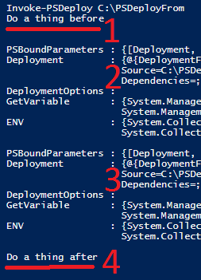
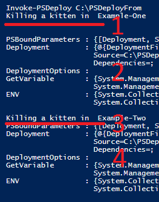

If you've used Pester, you might have noticed the Before/After constucts that allow you to call setup and teardown code, respectively. We borrowed this idea.  You might imagine a scenario where you always want a particular script to run before or after a deployment, ensuring you are set up for the deployment, and cleaned up afterwards.

We'll ilustrate two uses:  Scripts that you want to run before a single Deployment, or re-usable scripts to use on multiple deployments.

```powershell
Deploy Example {
    By noop Pre {
        FromSource MyModule
        To C:\PSDeployTo
        WithPreScript {
            "Do a thing before"
        }
    }
    By noop Post {
        FromSource MyModule
        To C:\PSDeployTo
        WithPostScript {
            "Do a thing after"
        }
    }
}
```

](images/prepost.png)

Notice that the WithPreScript ran before the Pre deployment, and WithPostScript ran before the Post deployment.

Now, let's look at re-using a scriptblock:

```powershell
$MyPreScript = {
    Write-Host "Killing a kitten in  $($Deployment.DeploymentName)"
    # Yada yada yada
}

Deploy Example {
    By noop One {
        FromSource MyModule
        To C:\PSDeployTo
        WithPreScript $MyPreScript
    }
    By noop Two {
        FromSource MyModule
        To C:\PSDeployTo
        WithPreScript $MyPreScript
    }
}
```

](images/prepost.reuse.png)

Notice that you can use the Deployment variable in the scriptblock, allowing some degree of dynamic scripting.

Hopefully you survived the horrifying color palettes.  Apologies.